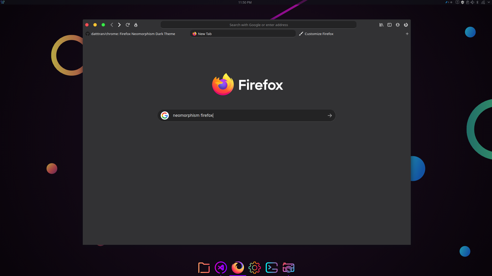
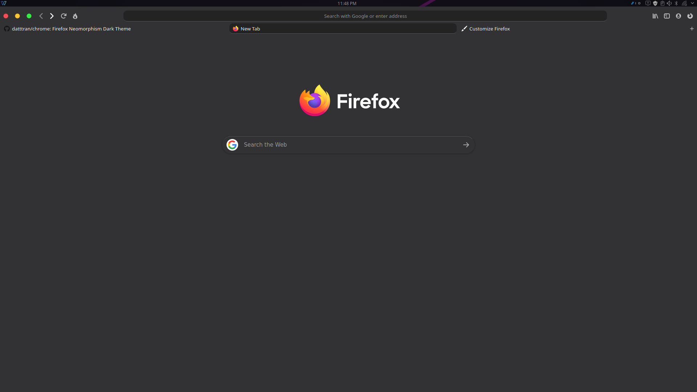

# Firefox Neomorphism Theme
Tested 73.0.1 / 74.0 /  Windows 10 / Linux Default Dark Theme
# How to use
1. Go to your profile directory by typing ```about:config``` in your address bar. 

2. In side the directory, open the terminal, run:

  	```git clone https://github.com/datttran/chrome.git```

3. Open a new tab in Mozilla Firefox. Type ```about:config``` in the address bar. Confirm that you will be careful if a warning message appears for you.

4. Enter the following text in the search box: toolkit.legacyUserProfileCustomizations.stylesheets.

5. Set the option ``toolkit.legacyUserProfileCustomizations.stylesheets`` to True.

6. Restart Firefox 

7. Add [OS style buttons](https://addons.mozilla.org/en-US/firefox/user/12528072/) extension

8. Enjoy the result.



# Optional
- For blur style search and bookmarks bar, go to ```about:config``` set```layout.css.backdrop-filter.enabled``` and ```gfx.webrender.enabled``` to true.

# Update
 - Adjust UI on ```about:home```
 
